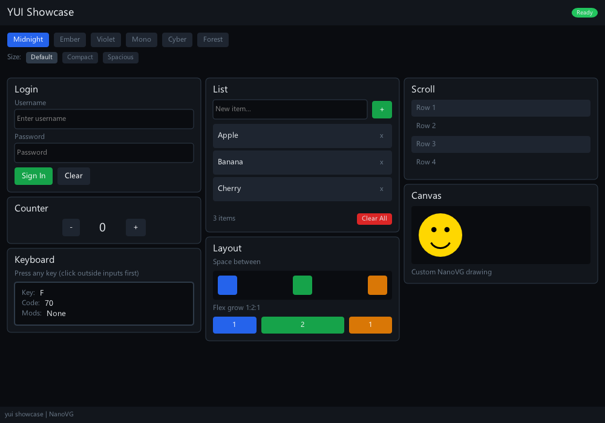
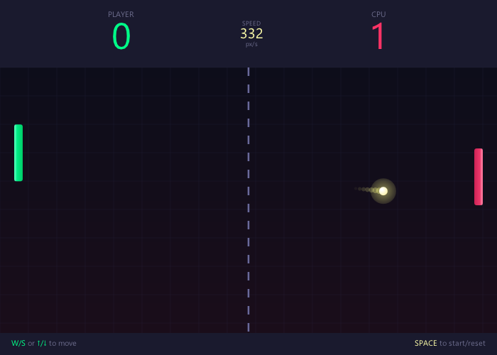

<div align="center">

# yui

**Declarative Flexbox UI library for C++**

[](https://en.cppreference.com/w/cpp/20)
[](LICENSE)



</div>

## Quick Example

```cpp
#include <yui/yui.hpp>

yui::Store<int> count(0);

yui::VNode Counter() {
    int n = count.use();

    return yui::Column({
        yui::Text("Count: " + std::to_string(n)),
        yui::Box(yui::Text("+"))
            .padding(12)
            .backgroundColor(0xFF3366FF)
            .onClick([] { count.set(
                [](int& n) { n++; }
            );})
    })
     .gap(16)
     .alignItems(yui::AlignItems::Center);
}
```

## Install

```bash
git clone --recursive https://github.com/user/yui.git
cd yui
```

### CMake (recommended)

```bash
cmake -B build
cmake --build build
```

On MSYS2/MinGW:
```bash
cmake -B build -G "MinGW Makefiles"
cmake --build build
```

Build specific targets:
```bash
cmake --build build --target test_runner     # tests
cmake --build build --target sdl_showcase    # SDL2 demo
cmake --build build --target nvg_showcase    # NanoVG demo
```

### Make (alternative)

```bash
make            # builds libyui.a → build/lib/
make test
```

**Requirements:** C++20 (GCC 10+, Clang 12+, MSVC 2019+), [Yoga](https://github.com/facebook/yoga) (included as submodule)

**Showcase dependencies:**

| | SDL | NanoVG |
|:--|:--|:--|
| Ubuntu | `apt install libsdl2-dev libsdl2-ttf-dev libsdl2-gfx-dev` | `apt install libglfw3-dev libglew-dev` + build nanovg |
| macOS | `brew install sdl2 sdl2_ttf sdl2_gfx` | `brew install glfw glew nanovg` |
| MSYS2 | `pacman -S mingw-w64-x86_64-SDL2{,_ttf,_gfx}` | `pacman -S mingw-w64-x86_64-{glfw,glew}` |

NanoVG is bundled as a submodule (`deps/nanovg`).

**IDE Setup (CLion, Visual Studio):**

Point CMake to your package installation:
```
-DCMAKE_PREFIX_PATH=/path/to/packages
```
For MSYS2: `-DCMAKE_PREFIX_PATH=C:/msys64/mingw64`

## Basics

```cpp
// Primitives
Box()                    // container
Text("Hello")            // label
Input(&value)            // text field
Scroll(content)          // scrollable
Canvas(drawFn)           // custom draw

// Layout
Row({ a, b })            // horizontal
Column({ a, b })         // vertical
Box()
    .width(100)
    .height(50)
    .flexGrow(1)
    .padding(8)
    .gap(12)
    .alignItems(AlignItems::Center)
    .justifyContent(JustifyContent::SpaceBetween)

// Styling
Box()
    .backgroundColor(0xFF1a1a1a)
    .borderRadius(4)
    .borderWidth(1)
    .hoverStyle(BoxStyle{.backgroundColor = 0xFF2a2a2a})

// Events
Box()
    .onClick([] { ... })
    .onHover([](bool h) { ... })

// Conditionals
When(visible, content)
If(cond, whenTrue, whenFalse)

// Lists (keyed for efficient diffing)
List(items,
    [](const Item& i) { return i.id; },       // key
    [](const Item& i) { return ItemView(i); } // render
)

// State
yui::Store<int> count(0);
int n = count.use();                   // read + subscribe
count.set([](int& n) { n++; });        // write + trigger re-render
```

## Example

```cpp
#include <yui/yui.hpp>
#include <yui/sdl/SdlRenderer.hpp>

yui::Store<int> count(0);

yui::VNode Counter() {
    int n = count.use();  // subscribes to changes

    return yui::Column({
        yui::Text("Count: " + std::to_string(n))
            .fontSize(24)
            .color(0xFFFFFFFF),
        yui::Box(yui::Text("+"))
            .padding(12)
            .backgroundColor(0xFF3366FF)
            .borderRadius(4)
            .onClick([] { count.set([](int& n) { n++; }); })
    }).gap(16).padding(20).alignItems(yui::AlignItems::Center);
}

int main() {
    // SDL setup...

    yui::sdl::SdlRenderer renderer(sdlRenderer, "font.ttf", 16);
    yui::Reconciler reconciler;

    while (running) {
        // handle events, forward clicks to reconciler...

        auto root = reconciler.mount(Counter());
        root->calculateLayout(windowWidth, windowHeight);
        renderer.render(root);
    }
}
```

## Docs

See the [docs](docs) for detailed examples (todo list, forms, custom renderers).

<div align="center">



</div>